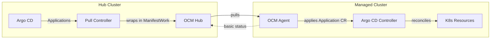
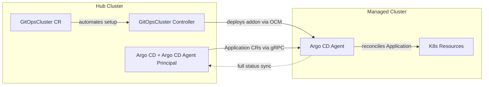

# Argo CD Pull Integration with Open Cluster Management

A Kubernetes operator that enables pull-based [Argo CD](https://argo-cd.readthedocs.io/)
application delivery for multi-cluster environments using
[Open Cluster Management (OCM)](https://open-cluster-management.io/) and
[Argo CD Agent](https://argocd-agent.readthedocs.io/).

This repository provides the **advanced pull model** powered by [argocd-agent](https://argocd-agent.readthedocs.io/), delivering superior Argo CD UI integration with full application status synchronization, detailed resource health, and live state comparison. While slightly more complex to set up than the basic model, the OCM `GitOpsCluster` custom resource automates the entire deployment setup process.

The **basic pull model** is also supported for simpler use cases.

TLDR: See [Getting Started with Advanced Pull Model (argocd-agent)](#getting-started-with-advanced-pull-model-argocd-agent)

## Overview

Traditional Argo CD deployments use a "push" model where applications are pushed from a centralized Argo CD instance to remote clusters. This project enables a "pull" model where remote clusters pull their applications from a central hub, providing better scalability, security, and resilience.

## Two Deployment Models

### Basic Pull Model

The basic pull model is a simpler approach that wraps Argo CD Application CRs in OCM ManifestWork objects and distributes them to managed clusters. It uses Argo CD's [skip-reconcile feature](https://argo-cd.readthedocs.io/en/latest/user-guide/skip_reconcile/) to prevent the hub from reconciling applications, allowing local Argo CD instances on managed clusters to handle reconciliation.



**How it works:**
1. Argo CD Applications on the hub are marked with `apps.open-cluster-management.io/pull-to-ocm-managed-cluster: "true"` label
2. Applications include the [`argocd.argoproj.io/skip-reconcile: "true"`](https://argo-cd.readthedocs.io/en/latest/user-guide/skip_reconcile/) annotation to prevent hub-side reconciliation
3. A controller wraps these Applications in ManifestWork objects
4. OCM agents pull the ManifestWork and apply the Application CRs to managed clusters
5. Local Argo CD instances reconcile the applications
6. Basic status information is reflected back through ManifestWork

**For complete documentation and deployment instructions, see:**
[OCM Basic Pull Model Solution](https://github.com/open-cluster-management-io/ocm/tree/main/solutions/deploy-argocd-apps-pull)

### Advanced Pull Model (argocd-agent)

The advanced pull model powered by [argocd-agent](https://argocd-agent.readthedocs.io/) provides multi-cluster GitOps with superior Argo CD integration. This model delivers the full Argo CD experience across all your clusters with complete status synchronization visible in the Argo CD UI.



**Key Benefits:**
- **Superior Argo CD UI Integration**: Full application details, resource tree, live state, and sync status displayed perfectly in the Argo CD UI
- **Complete Status Synchronization**: Detailed resource health, sync state, and errors reflected back to the hub in real-time
- **Better Argo CD Core Integration**: Built on the official argocd-agent project with direct integration to Argo CD core
- **Automated Setup via OCM GitOpsCluster**: The OCM `GitOpsCluster` CR automates the entire deployment process - while more advanced than the basic model, it handles all complexity

**How it works:**
1. Create a OCM `GitOpsCluster` CR that references an OCM Placement to select target clusters
2. The controller automatically deploys OCM argocd-agent add-on, configures secure gRPC communication, manages certificates, and sets up cluster registration
3. argocd-agent connects to hub Argo CD and synchronizes applications with **full status feedback**
4. Use `ApplicationSet` with `clusterDecisionResource` generator to automatically create Applications for all selected clusters using `spec.destination.name` for routing

**ApplicationSet Integration:**

The advanced pull model uses **destination-based mapping** where Applications are routed to managed clusters based on `spec.destination.name`. This enables natural `ApplicationSet` integration:

```yaml
apiVersion: argoproj.io/v1alpha1
kind: ApplicationSet
metadata:
  name: my-appset
  namespace: argocd  # Same namespace as ArgoCD
spec:
  generators:
  - clusterDecisionResource:
      configMapRef: ocm-placement-generator
      labelSelector:
        matchLabels:
          cluster.open-cluster-management.io/placement: placement
      requeueAfterSeconds: 30
  template:
    metadata:
      name: '{{name}}-myapp'
    spec:
      destination:
        name: '{{name}}'           # Routes to agent by cluster name
        namespace: my-namespace
      project: default
      source:
        repoURL: https://github.com/myorg/myrepo.git
        path: manifests
        targetRevision: HEAD
      syncPolicy:
        automated:
          prune: true
          selfHeal: true
        syncOptions:
        - CreateNamespace=true
```

The `clusterDecisionResource` generator reads from OCM `PlacementDecision` resources to discover target clusters. Each cluster gets its own Application with `destination.name` set to the cluster name, which the argocd-agent principal uses to route the Application to the correct agent.

For detailed argocd-agent architecture and operational modes, see [argocd-agent Documentation](https://argocd-agent.readthedocs.io/).

## Comparison: Basic vs Advanced

| Feature | Basic Pull Model | Advanced Pull Model (argocd-agent) |
|---------|-----------------|-----------------------------------|
| **Ease of Setup** | ✅ Easier - minimal configuration | ⚠️ More complex - automated via GitOpsCluster |
| **Argo CD UI Display** | ⚠️ Limited UI information | ✅ Full Argo CD UI with resource tree & live state |
| **Application Status** | ⚠️ Basic status via ManifestWork | ✅ Full detailed status via argocd-agent |
| **Resource Health** | ⚠️ Limited health information | ✅ Complete resource health details |
| **Sync Status** | ⚠️ Basic sync information | ✅ Detailed sync status and errors |
| **Live State** | ⚠️ Not available | ✅ Live state comparison |
| **Argo CD Core Integration** | ⚠️ External controller | ✅ Official argocd-agent project |
| **Setup Automation** | Manual RBAC and Argo CD setup | ✅ Automated via GitOpsCluster CR |
| **Certificate Management** | Manual | ✅ Automated |
| **Cluster Registration** | Manual cluster secrets | ✅ Automated via addon |
| **Skip Reconciliation** | ✅ Uses `argocd.argoproj.io/skip-reconcile` | ✅ Agent handles reconciliation |

### When to Use Each Model

**Use the Basic Pull Model if:**
- You want quick setup with minimal components
- Basic status feedback is sufficient
- You're just getting started with pull-based deployments

**Use the Advanced Pull Model (this repo) if:**
- You need complete application status visibility on the hub
- You want automated setup and lifecycle management
- You need detailed resource health and sync information
- You need full Argo CD UI integration
- You want simplified management of many clusters via OCM `GitOpsCluster` CR

## Getting Started with Advanced Pull Model (argocd-agent)

### Installation

1. **Setup OCM**: Install Open Cluster Management on your hub cluster and register your managed clusters. See [OCM Quick Start](https://open-cluster-management.io/getting-started/quick-start/)

2. **Setup Load Balancer**: Ensure your hub cluster has a load balancer configured for exposing Argo CD server to managed clusters for argocd-agent connectivity

3. **Install Helm Chart**:

```bash
# After OCM and load balancer setup:
#
# kubectl config use-context <hub-cluster>
helm repo add ocm https://open-cluster-management.io/helm-charts
helm repo update
helm search repo ocm
helm install argocd-agent-addon ocm/argocd-agent-addon --namespace argocd --create-namespace
```

This installs the GitOpsCluster controller and creates a GitOpsCluster resource that automatically deploys argocd-agent to your managed clusters.

**For complete documentation and deployment instructions, see:**
[OCM Advanced Pull Model Argo CD Agent Solution](https://github.com/open-cluster-management-io/ocm/tree/main/solutions/argocd-agent)

### Understanding GitOpsCluster

The `GitOpsCluster` custom resource is the control plane for managing argocd-agent deployments. It automates the entire setup process:

- **Cluster Selection**: References an OCM Placement to select which managed clusters receive argocd-agent
- **Automated Deployment**: Deploys argocd-agent to all selected clusters via OCM addon framework
- **Certificate Management**: Automatically generates and distributes TLS certificates for secure gRPC communication
- **Server Discovery**: Auto-discovers Argo CD server address and port
- **Status Monitoring**: Provides conditions to track deployment status

**Example GitOpsCluster configuration:**

```yaml
apiVersion: apps.open-cluster-management.io/v1alpha1
kind: GitOpsCluster
metadata:
  name: my-gitops-cluster
  namespace: open-cluster-management
spec:
  placementRef:
    kind: Placement
    name: argocd-placement  # OCM Placement to select clusters
  argoCDAgentAddon:
    mode: managed  # or "autonomous" - see argocd-agent docs
```

For detailed information about argocd-agent modes and configuration options, see the [argocd-agent Documentation](https://argocd-agent.readthedocs.io/).

## Advanced Configuration

### Adopting a Pre-Existing Hub Argo CD

By default, the `argocd-agent-addon` chart installs its own argocd-operator and hub `ArgoCD` CR. If you already run an argocd-operator-managed Argo CD instance on the hub (with `spec.argoCDAgent.principal.enabled: true`), you can adopt it instead of installing a second one:

```bash
helm install argocd-agent-addon ocm/argocd-agent-addon \
  --namespace argocd \
  --set hubArgoCD.enabled=false
```

With `hubArgoCD.enabled=false`, the chart still installs the `GitOpsCluster` controller, placement, and `ClusterManagementAddOn` - it just skips installing argocd-operator and the hub `ArgoCD` CR, relying on the existing instance for principal service discovery.

### Keeping argocd-agent Versions in Sync

The argocd-agent principal (hub) and agent (managed cluster) must run matching versions - a version mismatch fails the connection with `Auth failure: agent version is required`. By default, the hub principal's image is set via the chart's `argoCDAgent.image` value (`quay.io/argoprojlabs/argocd-agent:v0.9.0`), and the `GitOpsCluster` controller automatically reads whatever the hub principal's `ArgoCD` CR currently has at `spec.argoCDAgent.principal.image` and applies the same value to each managed cluster's generated `ArgoCD` CR - fresh on every reconcile, so a version bump made through the chart (`helm upgrade --set argoCDAgent.image=...`) keeps every managed cluster's agent in step automatically, without a separate field to maintain. See [Lifecycle & Upgrades](#lifecycle--upgrades) below for what "automatically" actually depends on.

To stop this auto-sync for a `GitOpsCluster` (e.g. to pin agent versions independently while validating a hub upgrade), annotate it:

```bash
kubectl annotate gitopscluster <name> -n <namespace> \
  apps.open-cluster-management.io/disable-agent-image-sync=true
```

This applies to every managed cluster selected by that `GitOpsCluster`'s placement (all-or-nothing - there's no per-cluster override). With sync disabled, the generated `ArgoCD` CR omits `spec.argoCDAgent.agent.image`, so the managed cluster falls back to whatever image argocd-operator itself defaults to. Remove the annotation (`kubectl annotate gitopscluster <name> -n <namespace> apps.open-cluster-management.io/disable-agent-image-sync-`) to resume following the hub principal. This has no effect if you're supplying a fully custom `ArgoCD` CR via `spec.argoCDAgentAddon.argoCDCRManifestWork` - in that case you already control `spec.argoCDAgent.agent.image` directly in your own manifest.

### Autonomous Mode

`spec.argoCDAgentAddon.mode` can be `managed` (default - Applications are authored on the hub and pushed down) or `autonomous` (the managed cluster owns its Application configuration directly; the agent transmits changes up to the principal for observability). A few things behave differently in autonomous mode:

- **No `destinationBasedMapping`**: argocd-agent rejects `destinationBasedMapping` outright for autonomous agents, so the generated `ArgoCD` CR omits it in this mode.
- **AppProjects must exist locally**: the managed/workload cluster doesn't run argocd-server in autonomous mode (the control-plane hub still does, and is used to observe agents and trigger sync/terminate), and there's no hub-to-spoke configuration push, so an `AppProject` (e.g. `default`) must already exist on the managed cluster before an `Application` there can be reconciled. In a real deployment this is expected to be provisioned via GitOps/app-of-apps, per upstream argocd-agent's guidance that "Argo CD configuration management must be externalized."
- **Applications are mirrored into a per-cluster namespace on the hub, read-only for configuration**: an `Application` created directly on managed cluster `cluster1` shows up on the hub in namespace `cluster1` (named after the `ManagedCluster`), not in the shared Argo CD namespace used by managed mode. The hub can't modify that Application's spec (git source, parameters, sync policy, etc.) - such edits are reverted to match the agent's version - but sync and terminate operations can still be triggered from the hub and are forwarded to the agent.

## Lifecycle & Upgrades

This covers what happens to each moving part when you run `helm upgrade` on the `argocd-agent-addon` release.

### Spoke controller/addon binary (every release)

The `argocd-pull-integration` controller image (`.Values.image`/`.Values.tag`) is bumped like any other Deployment - a normal rolling update on the hub, nothing addon-specific. The **managed-cluster side** follows automatically: the `GitOpsCluster` controller reads its own running pod's `CONTROLLER_IMAGE` env var (set from the same `image`/`tag` values) and writes it into an `AddOnTemplate` on every reconcile (`internal/controller/addon_template_management.go`). OCM's addon-framework propagates that `AddOnTemplate` change to each managed cluster via `ManifestWork`, and the work-agent there rolls the addon Deployment to the new image. `helm upgrade --set tag=<new>` on the hub is therefore sufficient on its own - no separate action is needed on any managed cluster.

### Hub Argo CD / argocd-agent version (when `hubArgoCD.enabled: true`, the default)

`helm upgrade --set argoCDAgent.image=<new>` updates the hub `ArgoCD` CR's `principal.image` directly (a normal Helm-managed resource). The hub `GitOpsCluster` resource also carries an annotation derived from that same value (`apps.open-cluster-management.io/hub-argocd-agent-image`, `charts/argocd-agent-addon/templates/gitopscluster/gitopscluster.yaml`), purely so that changing `argoCDAgent.image` also changes the `GitOpsCluster`'s own rendered content. This matters because the controller only watches the `GitOpsCluster` resource itself (plus `PlacementDecision`) - it does **not** watch the `ArgoCD` CR, and Helm re-applying an otherwise-unchanged `GitOpsCluster` manifest doesn't generate a Kubernetes watch event on its own. Without that annotation, a `helm upgrade` that only touches `argoCDAgent.image` would never cause a reconcile, so the new principal image would never get discovered or propagated. With it, `helm upgrade --set argoCDAgent.image=<new>` alone is sufficient: the hub principal rolls to the new image, and every managed cluster's agent follows automatically on the next reconcile.

### Hub Argo CD version (when `hubArgoCD.enabled: false`, adopting an existing instance)

The chart never touches the pre-existing Argo CD/argocd-operator install in this mode, so its lifecycle is entirely up to whoever manages it - a `helm upgrade` of this release (e.g. bumping the controller's own image tag) leaves the externally-managed operator Deployment and `ArgoCD` CR untouched.

The flip side: the chart still renders the `hub-argocd-agent-image` annotation described above whenever `argoCDAgent.image` is set - including with `hubArgoCD.enabled: false` - since that template logic doesn't check `hubArgoCD.enabled`. But the annotation only *changes* (and so only triggers a reconcile) when `argoCDAgent.image` changes through a `helm upgrade` of this release. A principal image change made directly against the adopted instance - by its own operator/owner, outside this chart entirely - never touches that Helm value, so the annotation stays put and no reconcile fires, and the change does not propagate to managed clusters on its own. Force a resync by touching the `GitOpsCluster` object after such an external change:

```bash
kubectl annotate gitopscluster <name> -n <namespace> force-sync="$(date +%s)" --overwrite
```

This triggers a reconcile, which re-discovers the current principal image and propagates it to every managed cluster.

## Development

See [CONTRIBUTING.md](CONTRIBUTING.md) for development guidelines.

## Contributing

We welcome contributions! Please see our [Contributing Guide](CONTRIBUTING.md) for details.

This project adheres to the Open Cluster Management [Code of Conduct](https://github.com/open-cluster-management-io/community/blob/main/CODE_OF_CONDUCT.md).

### Community

- **Slack**: [#open-cluster-mgmt](https://kubernetes.slack.com/channels/open-cluster-mgmt) on Kubernetes Slack
- **GitHub Issues**: Report bugs or request features
- **Community**: [Open Cluster Management](https://open-cluster-management.io/community/)

## License

argocd-pull-integration is licensed under the [Apache License 2.0](LICENSE).
